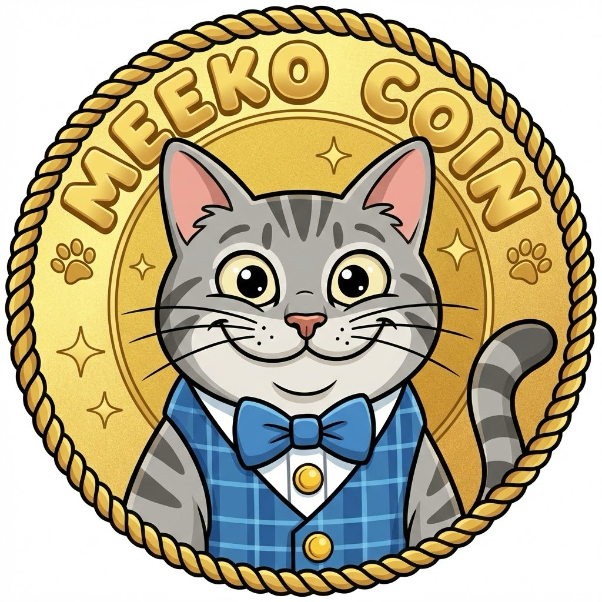

# MeekoCoin ($MEEKO)

<p align="center">
  
</p>

<p align="center">
  <strong>Smol but fierce. 420.69M tokens of pure grr.</strong>
</p>

<p align="center">
  <a href="https://solscan.io/token/9AqPGi9n7unEA8C6T6ujHxXsg1ywb1Ro6fitw9daMGNa">Solscan</a> •
  <a href="https://dexscreener.com/solana/9AqPGi9n7unEA8C6T6ujHxXsg1ywb1Ro6fitw9daMGNa">DEXScreener</a> •
  <a href="https://jup.ag/swap/SOL-9AqPGi9n7unEA8C6T6ujHxXsg1ywb1Ro6fitw9daMGNa">Trade on Jupiter</a>
</p>

---

## Contract Address

```
9AqPGi9n7unEA8C6T6ujHxXsg1ywb1Ro6fitw9daMGNa
```

## About Meeko

Meeko thinks he's a big strong man, but he's actually just a little fry. 

Scared of doorbells, fearless in the charts. Fixed supply, no rugs, just a little guy pretending to be huge.

**HODL like Meeko HODLs his favorite crinkly bag.**

## Tokenomics

| Property | Value |
|----------|-------|
| **Name** | MeekoCoin |
| **Symbol** | MEEKO |
| **Blockchain** | Solana |
| **Total Supply** | 420,690,000 |
| **Decimals** | 9 |
| **Tax** | 0% |
| **Mint Authority** | Revoked |
| **Freeze Authority** | Revoked |

100% of supply added to liquidity. No team tokens. No presale. Fair launch.

## Verified Safe

- ✅ Mint authority revoked (fixed supply forever)
- ✅ Freeze authority revoked (can't freeze wallets)
- ✅ No buy/sell tax
- ✅ Open source code

---

## For Developers

Want to create your own memecoin? This repo contains everything you need.

### Project Structure

```
meekocoin/
├── token/           # Solana token scripts
│   └── src/
│       ├── config.ts          # Token configuration
│       ├── create-token.ts    # Create token + metadata
│       ├── mint-tokens.ts     # Mint supply
│       ├── revoke-authority.ts # Revoke mint authority
│       ├── revoke-freeze.ts   # Revoke freeze authority
│       └── update-metadata.ts # Update logo/description
│
└── web/             # Next.js landing page
    ├── app/
    └── components/
```

### Quick Start

```bash
# Install dependencies
npm install

# Set up Solana CLI
solana-keygen new
solana config set --url devnet
solana airdrop 2

# Create token (devnet)
NETWORK=devnet npm run token:create
NETWORK=devnet npm run token:mint
NETWORK=devnet npm run token:revoke

# Run website
npm run web:dev
```

### Mainnet Deployment

```bash
solana config set --url mainnet-beta
NETWORK=mainnet npm run token:create
NETWORK=mainnet npm run token:mint
NETWORK=mainnet npm run token:revoke
```

Cost: ~0.05 SOL for token creation + whatever you add for liquidity.

---

## Disclaimer

MeekoCoin is a memecoin with no intrinsic value or expectation of financial return. It is purely for entertainment purposes. Cryptocurrency investments are highly volatile and risky. Never invest more than you can afford to lose. This is not financial advice. DYOR.

## License

MIT
